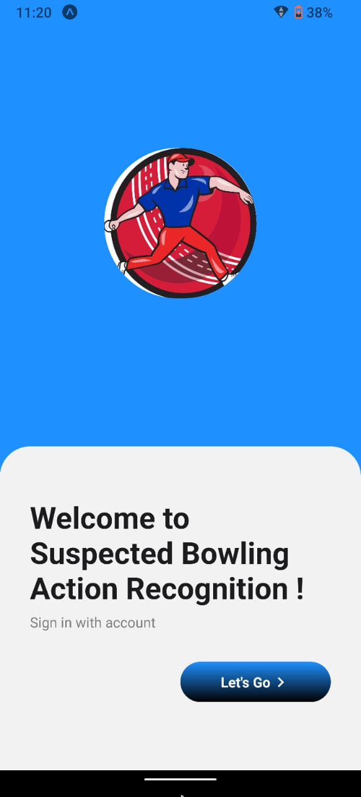
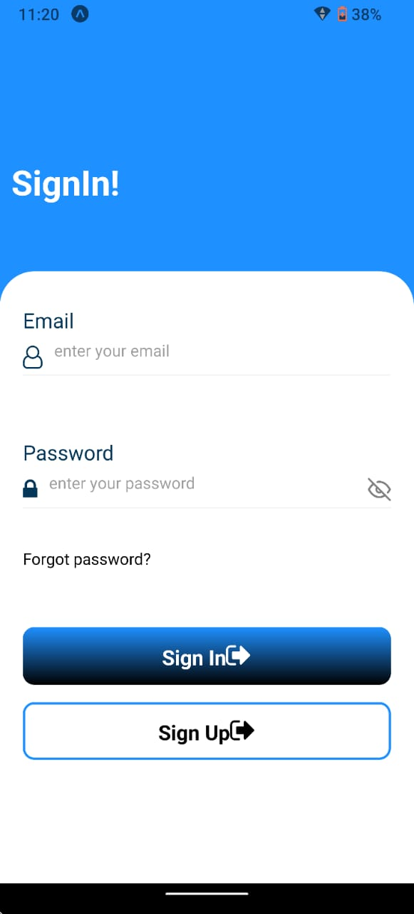
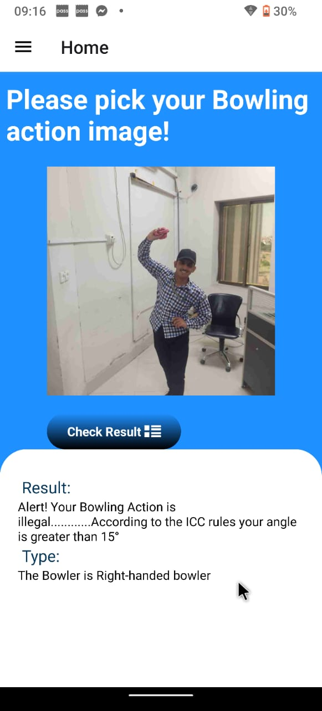
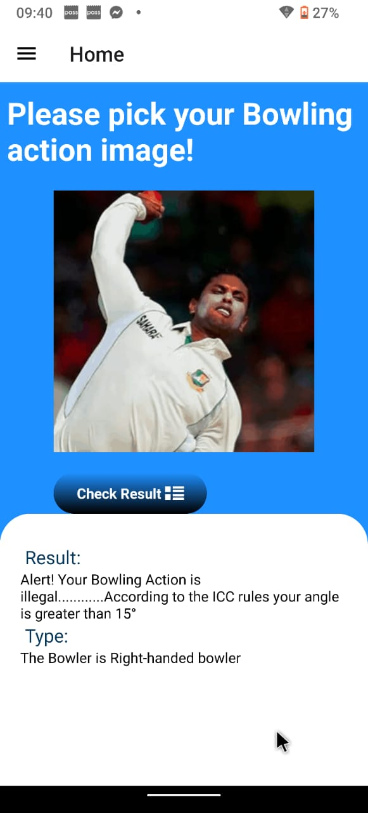
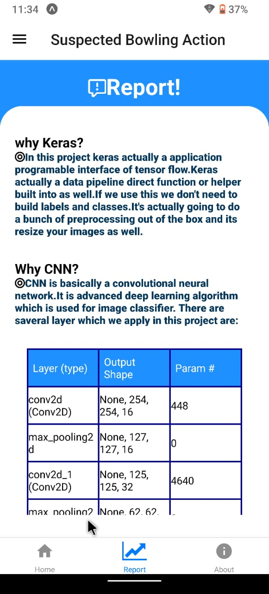
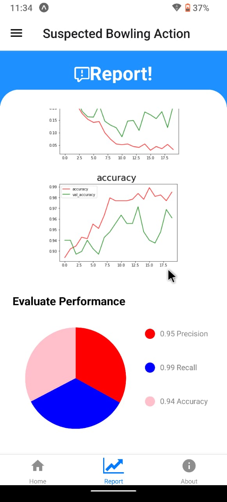
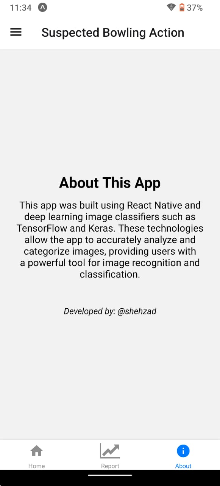

# Suspected_Bowling_Action
Machine learning Mobile_app

<h1>Core Libraries<h1>
  <h4>1. expo image picker</h4>
  <h4> 2. tensorflow </h4>
<h4>3. opencv</h4>
  <h4>4. matplot</h4>

  <h1>Application Interface<h1>
    
 
      
 

    <h1>Real-time images</h1>
    
  
      

     
    <h1>Directly Capture from Matches</h1>
    

    

     
    <h1>Report </h1>
     

    

    
